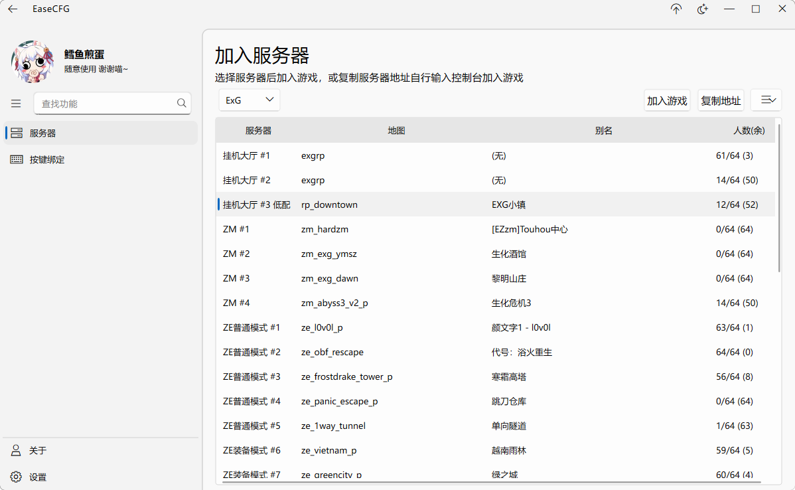
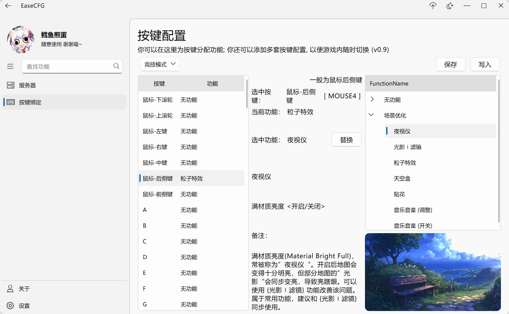

# ZE-Ease-cfg_GUI-Qt-Ela

## 服务器列表-界面预览

## 按键绑定-界面预览

## 软件功能一览

- 服务器列表 
    -
        - 服务器：加服、挤服
        - 地图：查览、订阅、收藏
        - （更多社区支持，持续开发中）
- 按键功能配置
    - 
        - 按键绑定：傻瓜式绑定社区功能到按键
        - 功能配置：暂不支持新增及修改功能
        - （更强大的功能自定义正在路上）
- 社区门户
    - 
        - 热门 ZE 直播、视频；各社区站点直达
        - （开发中）
- 其他
    - 
        - 神秘功能，规划中

## 依赖

- [[ElaWidgetTools](https://github.com/Liniyous/ElaWidgetTools)](基于QT-Widget开发的FluentUI风格的组件库)
